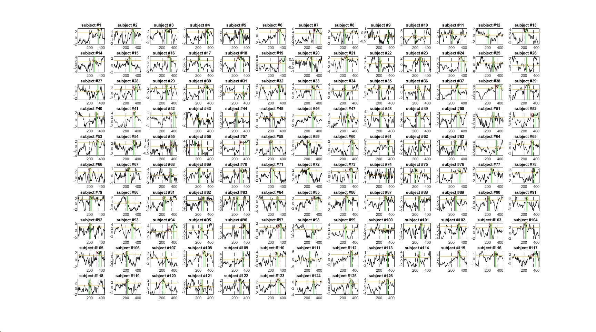
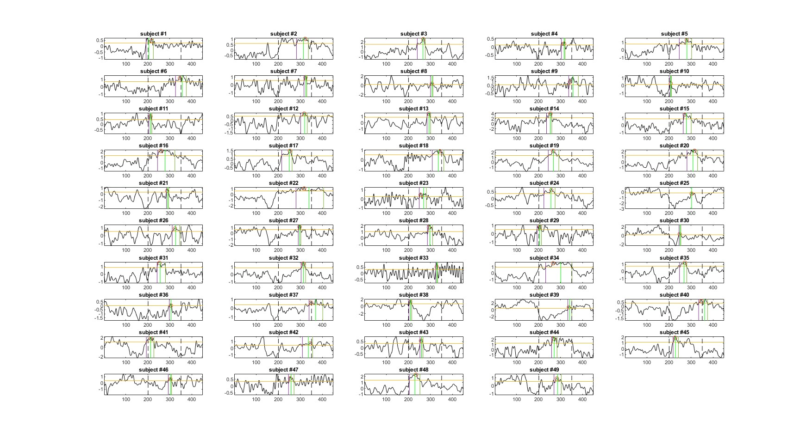

# (PART) Part 1: Matlab {-}

# Documentation of Scripts 

## Todo {-}


## a1_table_EEG_BD 

In this script I took the script provided by Dawid and adjusted it to my data set. 

**Aim:** 

* Create a table with of subjects with EEG and Behavior data

Data:

* HBN/EEG-ET_Joelle_MA_results
* Behavioral: _vis_learn.mat
* EEG: (g)ip.mat
  
### Details 

Noisy channels were excluded: 

>     noisy_chan = [1 8 14 17 21 25 32 48 49 56 63 68 73 81 88 94 99 107 113 119 125 126 127 128];

Triggers:

>     trigger = [11,12,13,14,15,16,17,18];


Categories are created: UN, NL, K, F

Accuracy is created: 0/1 (correct/false) 

Distance from newly learned is created

<span style="color: red;">TODO:</span>  Check if this is correct. Can be done in other script only table. Check what happens with two forgotten? 

**Filtering** 

>     EEG = pop_eegfiltnew(EEG,[],45);

**Re-referencing** 

>     EEG = pop_reref(EEG, [], 'keepref', 'on');

**Segmentation**

>     EEG = pop_epoch(EEG, {11,12,13,14,15,16,17,18}, [-0.1 0.8]); 

**Artifact rejection**


>       thresh = 90;

>       ind(idx4, 1) = squeeze(sum(sum([(full_table.Var4{idx4}(1:105, :) > thresh) | > (full_table.Var4{idx4}(1:105, :) < -thresh)],1),2) == 0);

>       ind = logical(ind);
>       full_table = full_table(ind,:);

Reject file: 

>     reject{1, index} = id;
>     reject{2, index} = sum(ind); % wie viele ausgeschlossen
>     reject{3, index} = length(ind);% wie viele trials pro person
        
**Select electrodes** (without CZ) 

>     channels = logical(E54 + E55 + E61 + E62 + E78 + E79);

**create one ERP out of selected electrodes**


### saved Files

Reject with numbers of trials that are?? <span style="color: red;">TODO:</span>  when reject?

>     save rejected.mat reject

full_tab 

>     save full_tab.mat full_tab

## a2_add_demo

In this script the table generated by [a1_table_EEG_BD] is used to add multiple variables. The data comes from excel file: 

>     bd = readtable("C:\Users\Oli\OneDrive - Universität Zürich UZH\Master3\MA\Excel HBN\BD.csv");

**Variables created:** 

* Primary Diagnose (DX01)
* All diagnosis 
* Comorbitity
* Gender
* Age 
* Agegroup 
* Index for No behavioral/demo data 

The age groups are created with bins of two years up to 19 years. All subjects older than 19 form one group. 
Furthermore, in this script explores how many subject out of full_tab will be excluded because of too many bad trials (reject file, see [a1_table_EEG_BD])

### Details 


| Argument         | N |
|:------------|:------------|
|Not in excel | 90      |
|0% good trials |   111    |
|100% good trials |   132    |
|< 75% good trials |    1003    |
|< 50% good trials |   350   |
|< 50% good trials & in full_tab| 249| 
| Sequence Length == 7 | 546 | 


**Trial influence on power** 

50% of trials = square(0.5) of original SNR. 0.75 of trials = 86% of original SNR [@luckIntroductionEventrelatedPotential2014]. 


**Knowledge Index & Learning Index**

The *Knowledge Index* and *Learning Index* were calculated in line with the paper of [@steinemannTrackingNeuralCorrelates2016] with the following forumla:


$$\begin{align}
    \text{Knowledge Index}(S,b) &= \frac{n_K(S,b)+ 0.5*n_{NL}(S,b)}{n_T(S,b)}\\
    \text{Learning Index}(S,b) &=\frac{n_{NL}(S,b)}{n_T(S,b)}\\
    \\
    \text{where}~S &= \text{Subject,} \\
  b &= \text{Block,}\\
  K &= \text{Known Stimuli,}\\
  NL &= \text{Newly Learned Stimuli,}\\
  T &= \text{Total Stimuli}\\

\end{align}$$

A second *Knowledge Index* without the weight of 0.5 was calculated as well since the experimental desgin differs from the one in [@steinemannTrackingNeuralCorrelates2016]:

$$\begin{align}
    \text{Knowledge Index}(S,b) &= \frac{n_K(S,b)+ n_{NL}(S,b)}{n_T(S,b)}\\
\end{align}$$


**Reject File**

The reject file was modified to show which to be rejected subjects are not found in full_tab. Furthermore, the age of all found subjects was included in the 7th row to further see the age distribution of rejected subjects. 

### Saved Files 

full_tab with demo saved as full_tab_a2

>   save full_tab_a2.mat full_tab  

file with index for subject without demographics 

>   save no_bd_data.mat idx

modified reject file

>   save rejected_a2.mat reject 

## a2_1_exlcude

In this script subjects are excluded using indexes. Exclusion criteria are in \@ref(fig:dias). 

## a3_1_topo

This script uses baseline corrected data to create topoplots (see \@ref(fig:topo) and \@ref(fig:topon)). Secondly, a third table was created with the important channels averaged together. This third table will be used for plotting ERP. 

### Details

Subjects not found in full_tab from [a2_1_exclude] were excluded from the topoplot file. Age group was created.
One problem which occurred is that: 

**full_tab_topo** has the same amount of subjects (i.e., n = 1599) but **2'367 trials less**

* full_tab = 60'561
* full_tab_topo = 58'194
* full_tab_baseline = 57'841 (- 2'720)

*the reason should be somewhere in [a1_table_EEG_BD]*  

## a3_compute_latencies

This script aims at computing p300 peak for individuals without forming a group.Using a method described in [@liesefeldEstimatingTimingCognitive2018], the data set presented a challenge in computing individual p300 peaks. Especially, finding the offset value seemed to be the problem, since many subject had a broad positive deflection at the end of an erp. Using a time window of 300-600 ms post stimulus and increasing percAmp from 0.6 to 0.8 led to warning for 14 subjects. Still, having a percAmp of 0.8 may be too high. 
Therefore, processing from here p300 peak is calculated base one a time window calcuted from group erp see [Time Window, Electrodes]. 


### Figures

The following figure \@ref(fig:ip) shows the individual ERP of subjects between age 5 to 7 with an percAmp of 0.6. To make it more visable only a subset of subjects out of that age group were plotted. For example, finding an offset for subject 19 was problematic. 

```{r ip, echo=FALSE, fig.cap="Individual ERP for age 5 to 7 years", fig.align = 'center'}

```


Generally, for older age subject finding individual peaks wasn't a challenge (see \@ref(fig:ipold))

```{r ipold, echo=FALSE, fig.cap="Individual ERP for age 18+", fig.align = 'center'}

```


## a3_p300

In this script the p300 was calculated based on time window determined by p300 peak of age group ERP (see \@ref(erp)). One problem might be that for the youngest age group the peak p300 is most likely confounded by a underlying broad positivity. 

## a4_plots

