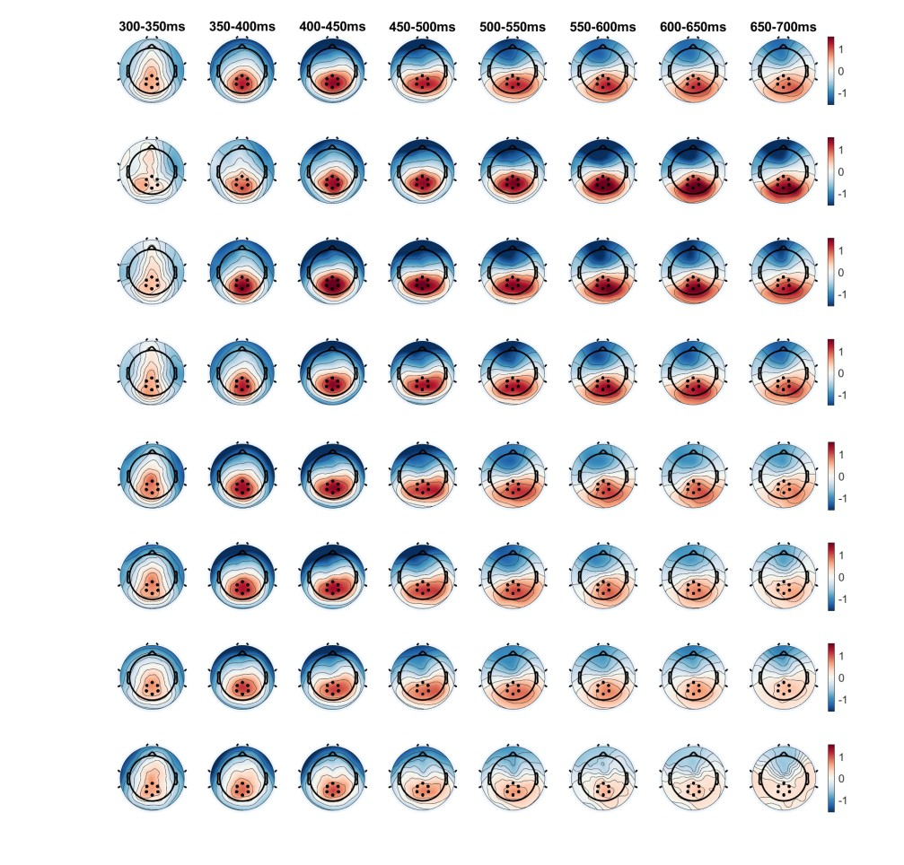
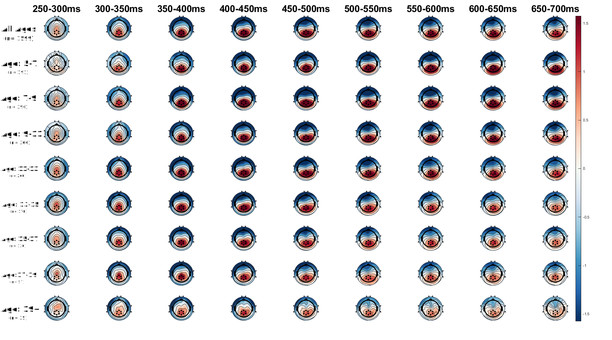

# Methods {#methods}


## Sample 

Figure \@ref(fig:dias) Shows the subjects excluding process.

```{r dias, echo= FALSE , fig.align='center', fig.cap="Exlcuding subjects.", out.width="100%"}

library(DiagrammeR)
DiagrammeR::grViz("digraph {
  graph [layout = dot, rankdir = TB]
  
  node [shape = rectangle]        
  rec1 [label = 'HBN Joelle: 
  n = 2999']
  rec2 [label = 'EEG and Behavioral Data:
  n = 2091']
  rec3 [label = 'Exlclude: bad EEG (n = 224):
  n = 1867']
  rec4 [label = 'Exlclude: less than 0.5 good trials (n = 177):
  n = 1690']
  rec5 [label = 'Exlclude: no demographics (n = 91):
  n = 1599']
  rec6 [label = 'Total Sample Size n = 1599']
  
  # edge definitions with the node IDs
  rec1 -> rec2 -> rec3 -> rec4 ->rec5 -> rec6
  }",
  height = 500)
  
```


## EEG and Age Groups 

### Time Window, Electrodes 

In the figure \@ref(fig:topo) we can see that the same electrodes can be used for all age groups. Furthermore, it seems as if the older age groups have less peak amplitude with shorter duration and less broad positivity. 

```{r topo, echo=FALSE, out.width="70%", fig.cap="Topoplot of age groups.", fig.align = 'center'}

```


Plotting the erp of different age groups indicates that in the younger age groups it's possible that the p300 peak measure is confounded underlying broad positivity (see \@ref(fig:erp)). 

```{r erp, echo=FALSE, out.width="100%", fig.cap="Topoplot of age groups.", fig.align = 'center'}

```


## Mixed Models 
## Clusteranalyse 