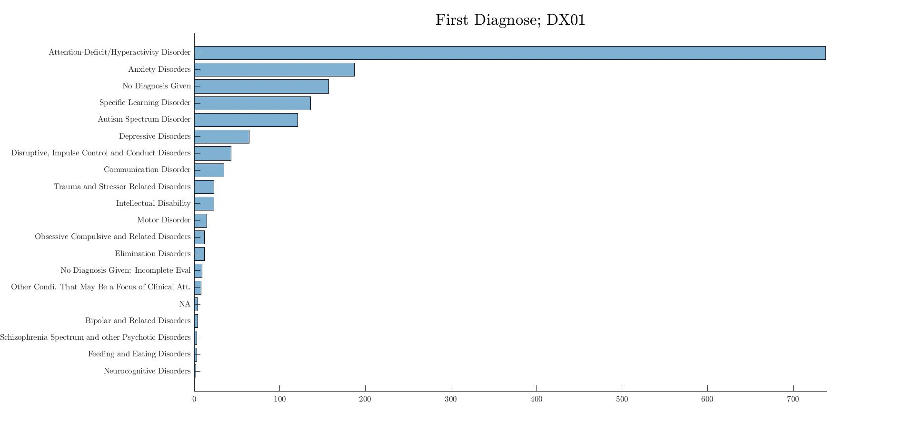
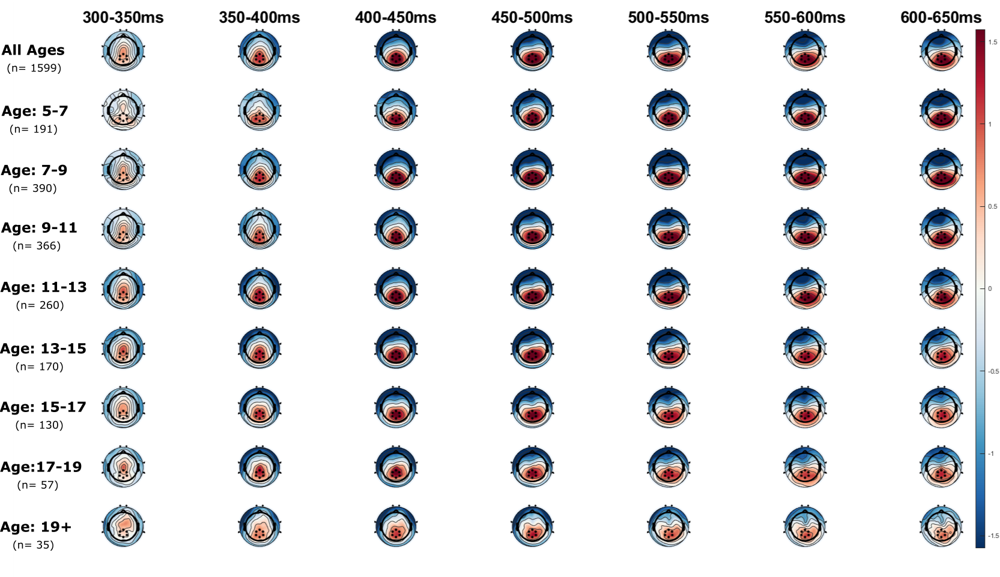
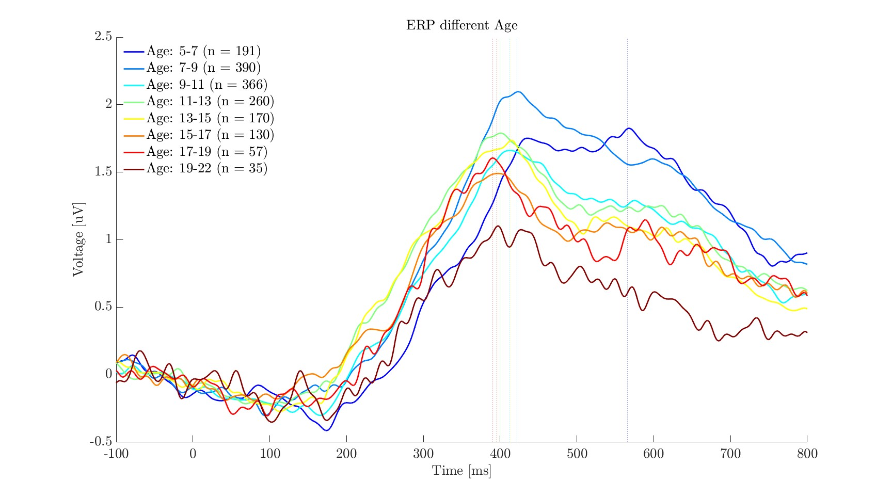

# Methods {#methods}


## Sample 

Figure \@ref(fig:exc) Shows the subjects excluding process.

```{r exc, echo= FALSE , fig.align='center', fig.cap="Exlcuding subjects.", out.width="100%"}

library(DiagrammeR)
DiagrammeR::grViz("digraph {
  graph [layout = dot, rankdir = TB]
  
  node [shape = rectangle]        
  rec1 [label = 'HBN Joelle: 
  n = 2999']
  rec2 [label = 'Full VSLP data (EEG and behavioral):
  n = 2091']
  rec3 [label = 'Exlclude: bad EEG (n = 224):
  n = 1867']
  rec4 [label = 'Exlclude: less than 0.5 good trials (n = 177):
  n = 1690']
  rec5 [label = 'Exlclude: no demographics (n = 91):
  n = 1599']
  
  rec6 [label = 'Total Sample Size n = 1599']
  
  # edge definitions with the node IDs
  rec1 -> rec2 -> rec3 -> rec4 ->rec5 -> rec6
  }",
  height = 500)
  
```


||mean| sd|median|min|max|range|skew|se|
|:-|:-|:-|:-|:-|:-|:-|:-|:-|
|age|11.28|3.45|10.67|5.04|21.9|16.86|0.61|0.01|


## Diagnosis 


```{r dia, echo=FALSE, out.width="100%", fig.cap="Diagnosis.", fig.align = 'center'}

```


|ADHD|Anxiety|Learning Disorder|Autism|Disruptive|Communication|Depression|Other
|:------|:------|:-|:-|:-|:-|:-|:-|
|983| 518 | 357| 253| 252| 222| 147| 0 |

|No Diagnosis|Incomplete|One Diagnose|Comorbidity|
|:-|:-|:-|:-|
|157 | 9 | 570|864|

## EEG and Age Groups 

### Brain Changes in CHildren and Adolesecents 

[@conklinWorkingMemoryPerformance2007] studied the behavioral performance in adolescents and children. 

* It was hypothesized that performance across multiple WM tasks would improve with age.
* Participants (N = 117) were categorized after selection to form four roughly equally sized groups by age (9–10 years, 11–12 years, 13–15 years, and 16–17 years of age).
* spatial WM (Spatial Span Task from the Wechsler Memory Scale, Third Edition [WMS-III; Wechsler 1997a]) 
* The Spatial Span Task was created to be a visual analog of the Digit Span Task (Wechsler, 1997a). The examiner tapped specified sequences of blocks of random location using a board that consists of 10 blue blocks fastened to a white plastic board. The participant was required to repeat the block taps in the same order (Spatial Span Forward) or in reverse order (Spatial Span Backwards). The number of blocks increased by one until the participant failed two trials of the same length.
* Forward span tasks (i.e., Digit Span Forward and Spatial Span Forward) are considered measures of attention and immediate recall.
* Age groups differed significantly from one another on the Digit Span Forward Task, F(3, 113) = 8.68, p < .001, with the age 9–10 years group demonstrating a shorter forward span than both the age 13–15 years group (p < .01) and the age 16–17 years group (p < .001), and the age 11–12 years group demonstrating a shorter forward span than the age 16–17 years group (p < .01).
* Results reported in that paper indicated a similar pattern of group differences across the Forward and Backward Spatial Span Tasks (which were analyzed together in a multivariate analysis) with children of age 9–10 years demonstrating a shorter spatial span (forward and backward) than children of age 13–15 years (p < .01) and children of age 16–17 years (p < .01), and children of age 11–12 years demonstrating a shorter spatial span than those of age 16–17 years (p < .01). No other group differences reached significance on the Spatial Span Task.
* Based on current study findings, behavioral data add convergent evidence for a pattern of largely posterior-to-anterior brain development previously surmised from postmortem and neuroimaging findings.
  * **thats why younger subject larger broad positity -> brain activiation doesn't move to as much to frontal parts compared to older subjects?** 
* A number of maladaptive conditions are associated with frontal lobe pathology in childhood or adolescence, including conditions with a significant genetic contribution (e.g., Attention Deficit Hyperactivity Disorder [ADHD]
* Knowing when and how far children with ADHD branch away from the normal trajectory with respect to performance on these frontally mediated tasks can help parents and educators anticipate needs and plan accordingly.
* This task-specific finding may reflect differences in underlying neurobiology, as recent research indicates differential neurotransmitter sensitivity of frontally mediated cognitive abilities in typically developing children (Diamond, Briand, Fossella, & Gehlback, 2004).


[@lucianaDevelopmentNonverbalWorking2005]

* Across age groups, performance was superior on forward versus backward span trials. Nine- to 10-year-olds performed worse than 13- to 15-year-olds, 16- to 17-year-olds, and 18- to 20-year-olds (pso.01). Eleven- to 12-year-olds performed worse than 16- to 17year-olds (po.05) and 18- to 20-year-olds (po.01). The oldest three age groups (13- to 15-year-olds, 16to 17-year-olds, and 18- to 20-year-olds) did not differ from one another. Thus, nonverbal memory span continues to improve up to 13 to 15 years old; counter to prediction, this developmental course appears to be similar for forward and backward spatial memory span.
* Otherwise, no significant main effects or interactions by gender were observed.
 * **but for eeg important?**
### Time Window, Electrodes 

In the figure \@ref(fig:topo) we can see that the same electrodes can be used for all age groups. Furthermore, it seems as if the older age groups have less peak amplitude with shorter duration and less broad positivity. 

```{r topo, echo=FALSE, out.width="70%", fig.cap="Topoplot of age groups.", fig.align = 'center'}
knitr::include_graphics("pho/topoboth.jpg")
```

Updated topoplot but not as clearly view able maybe add less time points and/or do "all ages" separately (\@ref(fig:topo-n)) ? 

```{r topo-n, echo=FALSE, out.width="100%", fig.cap="Topoplot of age groups.", fig.align = 'center'}

```
Plotting the erp of different age groups indicates that in the younger age groups it's possible that the p300 peak measure is confounded underlying broad positivity (see \@ref(fig:erp)). 

```{r erp, echo=FALSE, out.width="100%", fig.cap="ERP of age groups.", fig.align = 'center'}

```


## Mixed Models 
## Clusteranalyse 