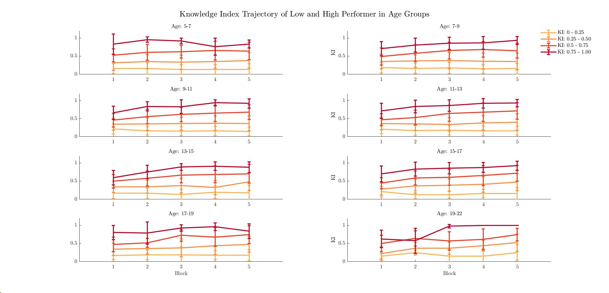

# Results {#Results}

## Behavioral Data

### Knowledge Index and Learning Index

In figure \@ref(fig:raincloud) we see the average of the Learning Rate and Knowledge Rate across all subjects. 

```{r raincloud, echo=FALSE, out.width="100%", fig.cap="Knowledge Index and Learning Rate.", fig.align = 'center'}
knitr::include_graphics("pho/rcKI_LI.jpg")
```


#### Do Subjects Learn?

The average knowledge Index across subjects doesn't seem to increase greatly. To further explore the learning performance, the subjects were formed into four groups based on their mean knowledge index across blocks:

* **Group 1**: mean(KI) <= 0.25
* **Group 2**: 0.25 < mean(KI) <= 0.50
* **Group 3**: 0.50 < mean(KI) <= 0.75
* **Group 4**: 0.75 < mean(KI)

Figure \@ref(fig:ki-perf) shows the knowledge index trajectory of different performers and with their standard deviation. Lower performer don't seem to increase performance (i.e. knowledge index) in most age groups. Knowledge index was calculated without an added weight as described in [a2_add_demo]. 

```{r ki-perf, echo=FALSE, out.width="100%", fig.cap="Knowledge Index of high and low performer.", fig.align = 'center'}

```
