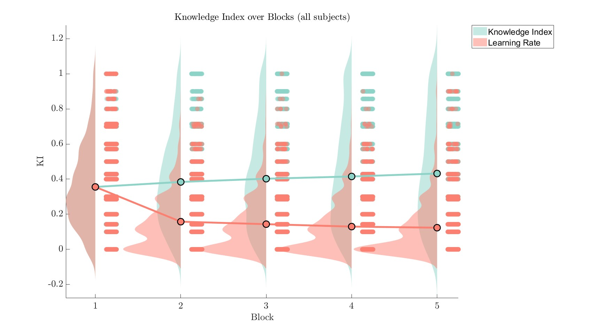

# Results {#Results}

## Behavioral Data

### Knowledge Index and Learning Index

In figure \@ref(fig:raincloud) we see the average of the Learning Rate and Knowledge Rate across all subjects. 

```{r raincloud, echo=FALSE, out.width="100%", fig.cap="Knowledge Index and Learning Rate.", fig.align = 'center'}

```