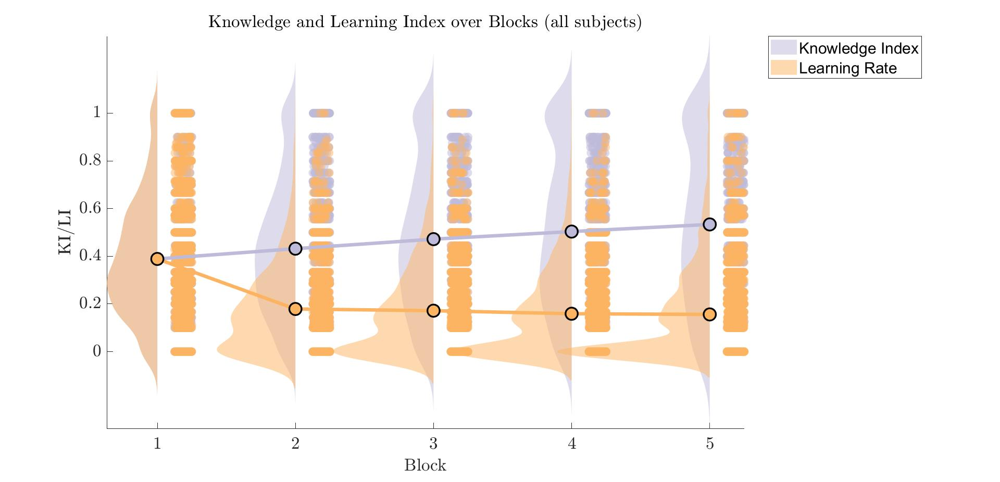

# Results {#Results}

## Behavioral Data

### Learning States

|  |Block 1 |Block 2|Block 3|Block 4| Block 5|
|:-|:-|:-|:-|:-|:-|
|Newly Learned|5'091 | 2'246 | 2'051|1'861|'1767|
|Unknown|7'957 | 5'543 | 4'767|4'196|3'793|
|Known|0 | 3'242 | 3'700|4'067|4'384|
|Forgotten|0 | 1'610 | 1'471|1'448|1'367|


|P300 Latency| Age: 5-7|Age: 7-9|Age: 9-11|Age: 11-13|Age: 13-15|Age: 15-17|Age: 17-19|Age: 19+|
|:-|:-|:-|:-|:-|:-|:-|:-|:-|
| |430 ms| 422 ms|412 ms| 400 ms|414 ms| 396 ms| 390 ms |396 ms|

### Knowledge Index and Learning Index

In figure \@ref(fig:raincloud) we see the average of the Learning Rate and Knowledge Rate across all subjects. The mean learning rate, displayed as red dot in the figure, seems to decrease mostly from first to second block. This indicates that, when looking a sample average level, learning tends to stagnate after the first block 

```{r raincloud, echo=FALSE, out.width="100%", fig.cap="Knowledge Index and Learning Rate.", fig.align = 'center'}

```

**Grand Mean of LI and KI**

In figure (\@ref(fig:kili)) we see the grand mean of KI, LR and LR ony first two blocks

```{r kili, echo=FALSE, out.width="100%", fig.cap="Grand Mean of Index and Learning Rate.", fig.align = 'center'}

```

#### Do Subjects Learn?

The average knowledge Index across subjects doesn't seem to increase greatly. To further explore the learning performance, the subjects were formed into four groups based on their mean Learning Rate across blocks:

* The subjects were split into four quintile:
  * [0-25%]
  * ]25-50%]
  * ]50-75]
  * ]75-100%]


Figure \@ref(fig:ki-perf) shows the knowledge index trajectory of different performers and with their standard deviation. Lower performer don't seem to increase performance (i.e. knowledge index) in most age groups. Knowledge index was calculated without an added weight as described in [a2_add_demo]. 

```{r ki-perf, echo=FALSE, out.width="100%", fig.cap="Knowledge Index of high and low Learners", fig.align = 'center'}

```


The same was done to inspect the Learning Rate as seen in figure(\@ref(fig:li-perf)).

```{r li-perf, echo=FALSE, out.width="100%", fig.cap="Learning Rate of high and low Learners", fig.align = 'center'}

```

### ERP 


```{r erpunnlk, echo=FALSE, out.width="100%", fig.cap="ERP of Learning States By Age Groups", fig.align = 'center'}

```

```{r erp_two, echo=FALSE, out.width="100%", fig.cap="ERP of Learning States By Age Groups", fig.align = 'center'}
knitr::include_graphics("pho/NLUN_byAge_2plots.jpg")
```

```{r erp_one, echo=FALSE, out.width="100%", fig.cap="ERP of Learning States By Age Groups", fig.align = 'center'}

```
