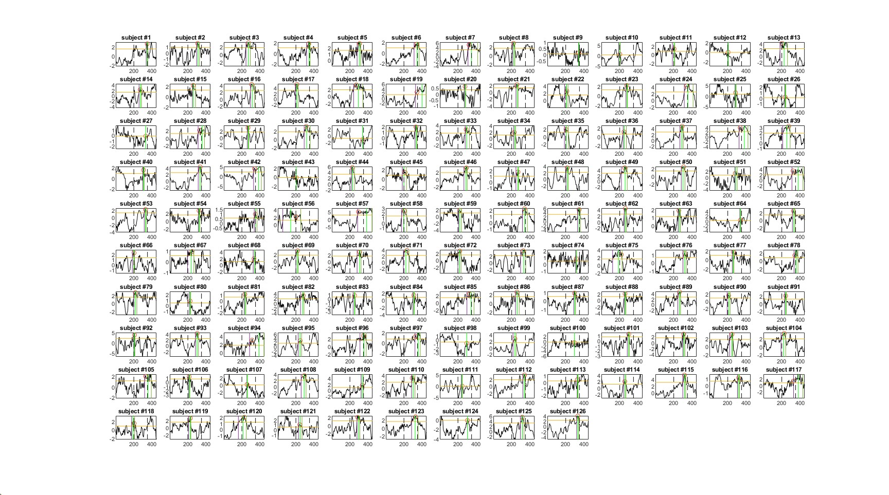

# About {-}

This file is a documentation of my master thesis: 

* In the **first part** Matlab scripts are documented
  * Every Scripts has it's own subtitle.
* In the **second part** ideas for my final study paper are described.
* In the **third part** the are general information that i want to store. 


## Todo {-}

| What              | Chapter |
|:------------|:------------|
| Triggers differ between age? | a1_table script        |

## New stuff: orientation {-}

| What              | Chapter | Link| Date|
|:------------|:------------|:------------|:----------|
| Fig:Topoplot | [Time Window, Electrodes]        |\@ref(fig:topo)| 19.12.2022 |
| Fig: ERP | [Time Window, Electrodes]        |\@ref(fig:erp)| 19.12.2022|
| Individual Peaks | [a3_compute_latencies] |\@ref(fig:ip), \@ref(fig:ipold)| 27.12.2022| 
| Subjects Excluded | [Sample] | \@ref(fig:dias)| 28.12.2022|


```{r include=FALSE}
# automatically create a bib database for R packages
knitr::write_bib(c(
  .packages(), 'bookdown', 'knitr', 'rmarkdown'
), 'packages.bib')
```

<!--chapter:end:index.Rmd-->

# (PART) Part 1: Matlab {-}

# Documentation of Scripts 

## Todo {-}

* Plots with font size 20
* KI, LI in full_tab
* transfer data and scripts to dynage cloud (better for dawid)?
* topoplot with data from new compiled table (dawid), should be the same
* In total three tables:
  * full_tab with one erp / trial + **no** baseline correction (multilevel)
  * table for topoplot: 105 electrodes for every trial (topoplot)
  * table one erp /trial **with** baseline correction (for plots)

## a1_table_EEG_BD 

In this script I took the script provided by Dawid and adjusted it to my data set. 

**Aim:** 

* Create a table with of subjects with EEG and Behavior data

Data:

* HBN/EEG-ET_Joelle_MA_results
* Behavioral: _vis_learn.mat
* EEG: (g)ip.mat
  
### Details 

Noisy channels were excluded: 

>     noisy_chan = [1 8 14 17 21 25 32 48 49 56 63 68 73 81 88 94 99 107 113 119 125 126 127 128];

Triggers:

>     trigger = [11,12,13,14,15,16,17,18];


<span style="color: red;">TODO:</span>  do younger subjects with less stimuli have  same trigger numbers? Look up do all have 8 sequence?

Categories are created: UN, NL, K, F

Accuracy is created: 0/1 (correct/false) 

Distance from newly learned is created

<span style="color: red;">TODO:</span>  Check if this is correct. Can be done in other script only table. Check what happens with two forgotten? 

**Filtering** 

>     EEG = pop_eegfiltnew(EEG,[],45);

**Re-referencing** 

>     EEG = pop_reref(EEG, [], 'keepref', 'on');

**Segmentation**

>     EEG = pop_epoch(EEG, {11,12,13,14,15,16,17,18}, [-0.1 0.8]); 

**Artifact rejection**


>       thresh = 90;

>       ind(idx4, 1) = squeeze(sum(sum([(full_table.Var4{idx4}(1:105, :) > thresh) | > (full_table.Var4{idx4}(1:105, :) < -thresh)],1),2) == 0);

>       ind = logical(ind);
>       full_table = full_table(ind,:);

Reject file: 

>     reject{1, index} = id;
>     reject{2, index} = sum(ind); % wie viele ausgeschlossen
>     reject{3, index} = length(ind);% wie viele trials pro person
        
**Select electrodes** (without CZ) 

>     channels = logical(E54 + E55 + E61 + E62 + E78 + E79);

**create one ERP out of selected electrodes**


### saved Files

Reject with numbers of trials that are?? <span style="color: red;">TODO:</span>  when reject?

>     save rejected.mat reject

full_tab 

>     save full_tab.mat full_tab

## a2_add_demo

In this script the table generated by [a1_table_EEG_BD] is used to add multiple variables. The data comes from excel file: 

>     bd = readtable("C:\Users\Oli\OneDrive - Universität Zürich UZH\Master3\MA\Excel HBN\BD.csv");

**Variables created:** 

* Primary Diagnose (DX01)
* All diagnosis 
* Comorbitity
* Gender
* Age 
* No behavioral/demo data 

Furthermore, in this script explores how many subject out of full_tab will be excluded because of too many bad trials (reject file, see [a1_table_EEG_BD])

### Details 


| Argument         | N |
|:------------|:------------|
|Not in excel | 90      |
|0% good trials |   111    |
|100% good trials |   132    |
|< 75% good trials |    1003    |
|< 50% good trials |   350   |
|< 50% good trials & in full_tab| 249| 


**Trial influence on power** 

50% of trials = square(0.5) of original SNR. 0.75 of trials = 86% of original SNR [@luckIntroductionEventrelatedPotential2014]. 


**Knowledge Index & Learning Index**

The *Knowledge Index* and *Learning Index* were calculated in line with the paper of [@steinemannTrackingNeuralCorrelates2016] with the following forumla:


$$\begin{align}
    \text{Knowledge Index}(S,b) &= \frac{n_K(S,b)+ 0.5*n_{NL}(S,b)}{n_T(S,b)}\\
    \text{Learning Index}(S,b) &=\frac{n_{NL}(S,b)}{n_T(S,b)}\\
    \\
    \text{where}~S &= \text{Subject,} \\
  b &= \text{Block,}\\
  K &= \text{Known Stimuli,}\\
  NL &= \text{Newly Learned Stimuli,}\\
  T &= \text{Total Stimuli}\\

\end{align}$$

A second *Knowledge Index* without the weight of 0.5 was calculated as well since the experimental desgin differs from the one in [@steinemannTrackingNeuralCorrelates2016]:

$$\begin{align}
    \text{Knowledge Index}(S,b) &= \frac{n_K(S,b)+ n_{NL}(S,b)}{n_T(S,b)}\\
\end{align}$$


**Reject File**

The reject file was modified to show which to be rejected subjects are not found in full_tab. Furthermore, the age of all found subjects was included in the 7th row to further see the age distribution of rejected subjects. 

### Saved Files 

full_tab with demo saved as full_tab_a2

>   save full_tab_a2.mat full_tab  

file with index for subject without demographics 

>   save no_bd_data.mat idx

modified reject file

>   save rejected_a2.mat reject 


## a3_compute_latencies

This script aims at computing p300 peak for individuals without forming a group.Using a method described in [@liesefeldEstimatingTimingCognitive2018], the data set presented a challenge in computing individual p300 peaks. Especially, finding the offset value seemed to be the problem, since many subject had a broad positive deflection at the end of an erp. Using a time window of 300-600 ms post stimulus and increasing percAmp from 0.6 to 0.8 led to warning for 14 subjects. Still, having a percAmp of 0.8 may be too high. 
Therefore, processing from here p300 peak is calculated base one a time window calcuted from group erp see [Time Window, Electrodes]. 


### Figures

The following figure \@ref(fig:ip) shows the individual ERP of subjects between age 5 to 7 with an percAmp of 0.6. To make it more visable only a subset of subjects out of that age group were plotted. For example, finding an offset for subject 19 was problematic. 

```{r ip, echo=FALSE, fig.cap="Individual ERP for age 5 to 7 years", fig.align = 'center'}

```


Generally, for older age subject finding individual peaks wasn't a challenge (see \@ref(fig:ipold))

```{r ipold, echo=FALSE, fig.cap="Individual ERP for age 18+", fig.align = 'center'}
knitr::include_graphics("pho/age18_latency.jpg")
```

<!--chapter:end:01-MatlabDoc.Rmd-->

# (PART) Part 2: Study {-}
# Introduction {#Intro}


## Importance of Learning


## Psychological disorders and Learning

## Measuring Learning, Different Paradigms 

### Visual Sequence Learning 

## Why EEG 

### Biomarker and Research Domain Critica 

## ERP, P3000, Models and Theories

## Previous research
## Research Gap? 
## Big Data 
## Hypothesis 
## Expolrative Goal 


<!--chapter:end:1-intro.Rmd-->

# Methods {#methods}


## Sample 

Figure \@ref(fig:dias) Shows the subjects excluding process.

```{r dias, echo= FALSE , fig.align='center', fig.cap="Exlcuding subjects.", out.width="100%"}

library(DiagrammeR)
DiagrammeR::grViz("digraph {
  graph [layout = dot, rankdir = TB]
  
  node [shape = rectangle]        
  rec1 [label = 'HBN Joelle: 
  n = 2999']
  rec2 [label = 'EEG and Behavioral Data:
  n = 2091']
  rec3 [label = 'Exlclude: bad EEG (n = 224):
  n = 1867']
  rec4 [label = 'Exlclude: less than 0.5 good trials (n = 177):
  n = 1690']
  rec5 [label = 'Exlclude: no demographics (n = 74):
  n = 1616']
  rec6 [label = 'Total Sample Size n = 1616']
  
  # edge definitions with the node IDs
  rec1 -> rec2 -> rec3 -> rec4 ->rec5 -> rec6
  }",
  height = 500)
  
```


## EEG and Age Groups 

### Time Window, Electrodes 

In the figure \@ref(fig:topo) we can see that the same electrodes can be used for all age groups. Furthermore, it seems as if the older age groups have less peak amplitude with shorter duration and less broad positivity. 

```{r topo, echo=FALSE, out.width="70%", fig.cap="Topoplot of age groups.", fig.align = 'center'}
knitr::include_graphics("pho/topoboth.jpg")
```


Plotting the erp of different age groups indicates that in the younger age groups it's possible that the p300 peak measure is confounded underlying broad positivity (see \@ref(fig:erp)). 

```{r erp, echo=FALSE, out.width="70%", fig.cap="Topoplot of age groups.", fig.align = 'center'}
knitr::include_graphics("pho/ERPgroups.jpg")
```


## Mixed Models 
## Clusteranalyse 

<!--chapter:end:2-Methods.Rmd-->

# Results {#Results}

<!--chapter:end:3-Results.Rmd-->

# Discussion {#Disscusion}

<!--chapter:end:4-Discussion.Rmd-->

# Limitations {#Limitations}

<!--chapter:end:5-Limitations.Rmd-->

# Further Research {#Further} 

<!--chapter:end:6-FurtherResearch.Rmd-->

# (PART) Part 3: Generall {-}
# Misc {.unnumbered #mi}

[@hedgeReliabilityParadoxWhy2018] talks about the difficulties, or paradox, that correlative research needs different data than experimental research. Another point made in this article is that: 

* reliability in experimental research means: finding an effect realiable and little interindividual variance. 
* reliability in correlational research means: ranking the subjects similar across time points: larger interindividual variance. 

<!--chapter:end:7-Misc.Rmd-->

`r if (knitr::is_html_output()) '
# References {-}
'`

<!--chapter:end:70-references.Rmd-->

